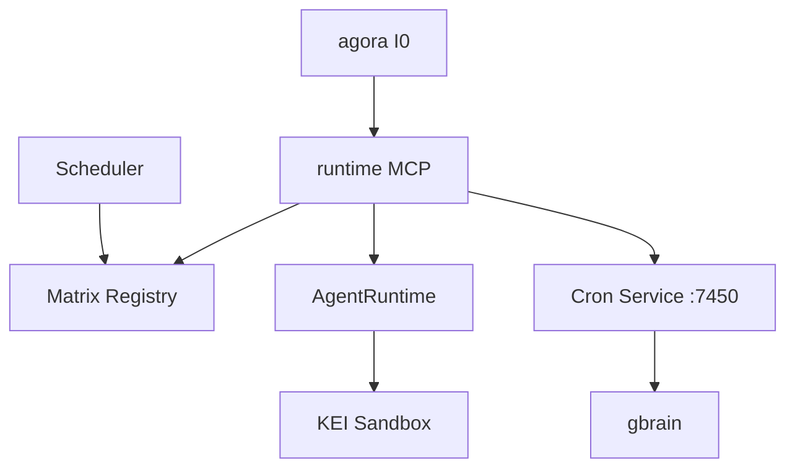

# runtime — Architecture

> **Layer**: L1 运行时  
> **Role**: 运行时基础设施 — Matrix 注册表 / 健康监控 / KEI 沙箱 / Scheduler  
> **Stack**: Python, FastAPI, FastMCP, APScheduler, Pydantic  
> **Health**: See local CI and runtime probes
> **SSOT**: 运行时健康、测试通过率、服务端口/工具计数以本项目 CI、运行时探针和 workspace governance SSOT 为准
>
> 系统全景参见：[`../../docs/PANORAMA.md`](../../docs/PANORAMA.md)

---

## 1. 内部架构



## 2. 入口

| Type | Entry | Port / Notes |
|:--|:--|:--|
| CLI | `runtime / ecos-matrix-scheduler` |  |
| MCP stdio | `runtime.mcp_server` | MCP tools (见 project-registry.yaml: runtime) |
| HTTP | `cron_service/server.py` | :7450 |

## 3. 核心模块

| Module | Responsibility |
|:--|:--|
| `src/runtime/matrix.py` | Service registry |
| `src/runtime/scheduler.py` | 15s health loop + auto-heal |
| `src/runtime/kei_sandbox.py` | C-level audit-hook sandbox |
| `src/runtime/mcp_server.py` | FastMCP server |
| `src/runtime/executor/engine.py` | AgentRuntime core |
| `src/runtime/cron_service/` | FastAPI cron service |
| `src/runtime/bus_consumer.py` | Agora SSE → SQLite → gbrain |

## 4. 测试

```bash
cd projects/runtime && make test
```

## 架构概览

参见工作区架构概览图：[`../../docs/ARCHITECTURE-DIAGRAM.md`](../../docs/ARCHITECTURE-DIAGRAM.md)
