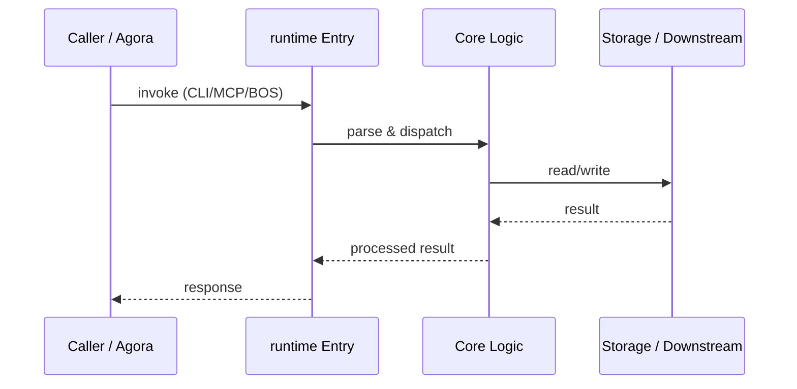

# runtime — Call Chain

> 本文档描述 runtime 内部最核心的一条调用链 / 数据流。
>
> 通用跨层调用链参见：[`../../docs/I0-AGORA-CALLCHAIN.md`](../../docs/I0-AGORA-CALLCHAIN.md)

---

## 关键路径

1. 1. `ecos-matrix-scheduler` runs 15s health loop (`scheduler.py`)
2. 2. Reads/writes `~/runtime/matrix.yaml` via `matrix.py`
3. 3. On task execution, `AgentRuntime` loads KEI rules (`kei_sandbox.py`)
4. 4. Tool calls are intercepted by audit hook; blocked actions logged
5. 5. `bus_consumer.py` receives agora SSE events and persists to gbrain
6. 6. Cron service (:7450) exposes FastAPI + MCP for scheduled tasks

## Sequence Diagram

