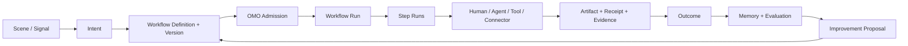

# eCOS v6 愿景驱动的长期架构与战略执行方案

## 1. 执行结论

eCOS 已经完成从零散工具集合到受治理 AI 操作系统骨架的跨越。协议、运行时、知识、
治理、算力、入口和证据链均已有真实实现，下一阶段的主要矛盾不再是“缺少能力”，而是：

1. 能力数量增长快于用户主路径收敛。
2. 战略、运行状态、项目注册表和 Git 仓库身份存在不同步风险。
3. 多个引擎在编排、状态、路由和记忆方面仍有职责交叉。
4. 治理成熟度高于真实场景使用频率，容易继续优化图纸而非产品结果。
5. 部分“智能化”能力已经有入口和契约，但尚未形成基于上下文、评测和反馈的真实适应。

因此，未来三年的战略不再按新增 Phase 或新增子项目推进，而按四条可重复的黄金旅程推进：

- 工程交付闭环。
- 知识到行动闭环。
- 受控多 Agent 协作闭环。
- 外部知识与能力触达闭环。

一句话战略：

> 把 eCOS 收敛成个人智能执行操作系统：用户只表达一次意图，系统完成理解、规划、
> 隔离执行、验证、交付、记忆和改进，全过程可暂停、可解释、可恢复、可回滚。

## 2. 事实口径

本文只定义方向、边界和阶段门槛。动态事实的权威来源如下：

| 事实 | 权威来源 |
|---|---|
| 当前 Phase、任务、健康与运行状态 | [`.omo/state/system.yaml`](../.omo/state/system.yaml) |
| 当前目标 | [`.omo/goals/current.yaml`](../.omo/goals/current.yaml) |
| 项目元数据 | [`docs/project-registry.yaml`](project-registry.yaml) |
| BOS 能力与路由 | [`projects/agora/etc/bos-services.yaml`](../projects/agora/etc/bos-services.yaml) |
| 稳定架构契约 | [`ARCHITECTURE.md`](../ARCHITECTURE.md) |
| 真实交付门禁 | [`docs/G-DEL-PHASE2-BOARD.md`](G-DEL-PHASE2-BOARD.md) |
| 任务与执行台账 | [`.omo/tasks/registry/INDEX.md`](../.omo/tasks/registry/INDEX.md) |
| 决策记录 | [`.omo/_knowledge/decisions/INDEX.md`](../.omo/_knowledge/decisions/INDEX.md) |

任何战略评审必须同时检查声明、可解析入口、真实执行和用户结果，不得用文件存在、
schema 通过或模拟 harness 代替真实完成。

## 3. 对愿景与使用者的理解

eCOS 的目标使用者首先是系统所有者本人。核心需求不是拥有更多工具，而是获得一个：

- 不丢工作、不覆盖成果、可以安全并行的执行系统。
- 能积累个人知识、决策依据和长期偏好的外置大脑。
- 能把复杂意图拆成受治理执行，并持续交付结果的数字副官。
- 本地优先、数据可控、云边可切换的私有智能底座。
- 可以演进，但不会绕过人类授权直接改变生产状态的受控系统。

系统所有者具有强烈的长期主义和体系化倾向。这是架构完整性的来源，也带来一个需要机制化
约束的风险：能力可能在真实场景出现前被提前建设到完整形态。后续采用“场景激活门”控制投资：

1. 有明确使用者和可重复意图。
2. 在连续四周内存在真实需求或明确机会窗口。
3. 有可量化结果，而非仅有技术完成定义。
4. 数据权限、操作责任和人工接管方式明确。
5. 现有平台无法通过配置或领域包满足。

未通过激活门的能力保留契约、测试和证据，但冻结新增投入。KEMS 与 Family Hub 当前按此规则管理。

## 4. 当前阶段判断

项目处在“平台产品化过渡、场景验证开始、状态真相仍需归一”的阶段。它已经越过纯概念和
基础设施早期，但还没有进入稳定产品使用期，更不能按自进化操作系统或产品市场匹配来判断。

已经具备：

- Cockpit 人类入口和 Agora Agent 路由。
- OMO 任务、治理、审计、证据和 Agent Workflow。
- Runtime 执行、沙箱、注册、同步和故障处理基础。
- AetherForge 网关、Mesh、Swarm 和本地算力接入。
- Kairon/KOS 与 gbrain 的知识处理、检索和持久化能力。
- ECOS、MOF、X1-X4 和 GaC 的协议与治理资产。

尚未真正完成：

- 一条被持续使用、可测量业务收益的端到端产品主路径。
- 项目注册表、current goals、运行投影与仓库远端身份的统一时间线。
- 编排、策略、执行、状态和知识真相之间的最终职责收敛。
- 基于真实上下文、评测集、置信度、成本和反馈的自适应智能。
- 真实物理多机门禁；该能力按既有决策继续 deferred，不占当前主轴。

## 5. 北极星与战略原则

### 5.1 北极星指标

北极星指标是“每周成功完成并被实际消费的闭环旅程数”。一次闭环必须同时满足：

- 有明确用户意图。
- 通过统一入口进入。
- 经过受治理的计划和执行。
- 产生用户可消费结果。
- 留下可验证证据和可复用记忆。
- 失败时可恢复、可解释或可回滚。

### 5.2 战略原则

1. 场景拉动架构，禁止为未知需求新增顶层项目。
2. 一个受众一个入口：人类走 Cockpit，Agent 走 Agora，治理写入走 OMO broker。
3. 一个事实一个所有者，派生索引必须可从权威源重建。
4. 产品与用户旅程投入不低于 70%，治理与元模型投入不高于 30%。
5. 单机主路径先稳定，再扩大到多 Agent 和多设备。
6. 任何“智能化”声明必须有上下文、评测、成本、置信度和回滚证据。
7. 自进化只能生成受治理提案，不能直接修改生产真相。
8. 外部知识、数据、方法、工具、模型和渠道必须通过统一连接织层接入，并绑定真实场景、结果指标和可撤销生命周期。

## 6. 五平面目标架构

五平面是现有 `5+4+1+1` 的产品职责投影，不替代稳定分层契约。

```text
用户与 Agent
    |
体验面: Cockpit / Cockpit UI
    |
控制面: C2G / OMO / MetaOS Policy
    |
织网与执行面: Agora / Runtime / AetherForge / Bus
    |
知识与记忆面: Kairon / KOS / gbrain
    |
协议与进化面: ECOS / Model-driven / L4

Observability 横切所有平面，提供度量、追踪和告警。
```

外部连接织层横切体验、控制、执行和知识平面，但不拥有任务、知识、凭据或运行状态真相。

### 6.1 体验面

- `cockpit` 是唯一人类 CLI、HTTP 和操作控制面。
- `cockpit-ui` 是表现层，不保存其他域的业务真相。
- 子项目 CLI 保留为开发和诊断入口，不作为产品主入口宣传。
- UI 获取不到真实数据时必须显示 unavailable/demo，不得用随机或默认指标伪装运行状态。

### 6.2 控制面

- `c2g` 只负责把意图、Pitch 和 Bet 物化为治理输入。
- `omo` 独占任务、债务、审批、证据、执行状态和变更审计。
- `metaos` 收窄为策略、门控和免疫插件，不再拥有第二套任务真相或通用 DAG 状态。
- MetaOS 连续两个季度若没有独立消费者和发布价值，应合并为 OMO policy package。

### 6.3 织网与执行面

- `agora` 只做发现、BOS 路由、代理和跨域通信，不持有领域业务逻辑。
- `runtime` 负责实际执行、沙箱、调度状态、心跳和恢复。
- `aetherforge` 负责模型、凭据、配额、成本、算力节点和 Swarm 计算。
- `bus-foundation` 是内部 Data/Event/Control 基础库，不发展第二套路由或任务系统。
- `mesh-router` 的能力归属 AetherForge，稳定后不再以根目录独立实现存在。

### 6.4 知识与记忆面

- `kairon` 负责采集、解析、结构化、推理和领域知识处理。
- `KOS` 负责可重建索引、检索执行、本体投影和排序。
- `gbrain` 负责持久知识对象、关系、偏好、长期记忆和共享上下文。
- 原始源清单和持久知识对象是权威事实；向量、FTS、本体图等是可重建派生物。
- Kairon 与 gbrain 之间禁止保存互不一致的第二份 canonical document。

### 6.5 协议与进化面

- `ecos` 只拥有协议、MOF、约束、schema 和可执行验证，不反向依赖 L2/L3 业务实现。
- `model-driven` 只负责投影、生成和生命周期 DSL，不持有运行任务状态。
- `l4-kernel` 只负责系统自我模型、域目录、能力边界和演进提案。
- KEMS 从 L4 内核职责降为可冻结、可安装、可移除的领域包。

### 6.6 外部连接织层

External Connection Fabric 统一承接六类外部能力：`SourcePack`、`ResourcePack`、`MethodPack`、
`ToolPack`、`ChannelPack` 和 `ModelPack`。它只拥有描述、准入、路由、健康、来源和生命周期，
不创建第二套任务、权限、证据或持久知识真相。机器契约见
[`external-connection-fabric.yaml`](../.omo/_truth/registry/external-connection-fabric.yaml)，
操作标准见 [`external-connection-fabric.md`](../.omo/standards/external-connection-fabric.md)。

## 7. 项目组合决策

| 组合 | 决策 | 长期边界 |
|---|---|---|
| cockpit + cockpit-ui | 核心 | 唯一人类入口和表现面 |
| agora | 核心 | 唯一 Agent Mesh 与 BOS Router |
| c2g + omo | 核心 | 意图入口与治理状态机 |
| runtime + aetherforge | 核心 | 执行系统与算力系统 |
| kairon/KOS + gbrain | 核心 | 知识处理、索引和持久记忆 |
| ecos | 核心协议 | 元模型、约束、schema、验证 |
| metaos | 收敛观察 | 收窄为 OMO policy plugin |
| model-driven | 收敛观察 | 收窄为生成与投影工具 |
| l4-kernel | 收敛观察 | 自我模型，剥离领域业务 |
| bus-foundation | 内部基础库 | 事件与控制传输原语 |
| observability | 横切基础设施 | 追踪、指标、日志、告警 |
| omo-debt | 合并候选 | 能力并入 OMO 后归档独立仓 |
| mesh-router | 合并候选 | 能力并入 AetherForge Mesh |
| toolbox | 能力供应商 | 通过 Agora/BOS 暴露，不进入核心状态面 |
| KEMS / family-hub | 冻结领域包 | 通过场景激活门后再恢复投入 |

未来十二个月原则上不新增顶层项目。例外必须通过架构评审并证明现有责任方无法承载。

## 8. 四条黄金旅程

### 8.1 J1 工程交付闭环

```text
意图 -> C2G/OMO task -> 独立 worktree -> Agent Workflow
     -> 实施与测试 -> PR -> 合并 -> evidence -> gbrain/KOS 经验回写
```

这是当前最高优先级，因为它已经是系统所有者的真实高频场景，并直接回应“不丢失、不覆盖、
随时提交、独立 worktree、PR 合并”的核心诉求。

退出门槛：连续真实任务均能从意图走到合并和证据，失败可恢复，且无共享主工作区覆盖事故。

### 8.2 J2 知识到行动闭环

```text
代码/文档/资料 -> Kairon 处理 -> gbrain 持久化 -> KOS 检索
              -> 判断/建议 -> OMO task -> 执行 -> 结果回写
```

成功标准不是索引数量，而是知识是否减少查找时间、改善决策并被后续任务复用。

### 8.3 J3 受控多 Agent 协作闭环

```text
可拆任务 -> 独立性判定 -> 多 Agent 分派 -> 独立产物
        -> 汇总验证 -> 冲突检测 -> 人工批准 -> 交付
```

仅用于边界清晰、无共享写入或可分区写入、可独立验收的工作。架构分析、调试、复杂设计和
强耦合改动继续由单 Agent 主导。物理多机保持 deferred，直到真实需求重新触发。

### 8.4 J4 外部知识与能力触达闭环

```text
场景 -> 发现资源 -> 沙箱验证 -> OMO 准入 -> Agora 选择
     -> Workflow Mesh 调用 -> 来源/回执/成本证据 -> 结果回写 -> 方法或路由改进提案
```

J4 的成功标准不是连接数量，而是外部资源是否缩短了决策和交付时间、提高了证据质量，
并且在权限、成本、时效或可用性变化时能够降级、隔离和回滚。

## 9. 受控智能与进化闭环

系统的智能化成熟度按五级递进：

| 级别 | 能力 | 进入条件 |
|---|---|---|
| I1 可调用 | 能力有真实入口并可执行 | 非 mock，端到端 smoke 通过 |
| I2 可评测 | 有数据集、指标和基线 | 质量、成本、延迟可重复测量 |
| I3 可选择 | 能根据上下文选择模型、工具和策略 | 路由决策有解释和置信度 |
| I4 可适应 | 能从结果反馈生成改进提案 | 影子评测优于基线 |
| I5 可进化 | 能灰度晋升新策略并安全回滚 | 人工批准、审计、回滚全部有效 |

标准进化回路：

```text
观察 -> 评测 -> 改进提案 -> 影子运行 -> 人工审批
     -> 灰度发布 -> 证据对比 -> 晋升或回滚 -> 经验入库
```

职责分配：L4 提案，OMO 治理，Runtime 执行，AetherForge 提供算力，Observability 测量，
gbrain 保存经验，ECOS 只在 ADR 批准后更新约束。

B.D.S.K. 后续演进重点不是增加 Persona 文案，而是让四角意见真实读取提案上下文、历史证据、
成本、风险和评测结果，并通过 AetherForge 选择本地或云端模型。固定模板只能标记为 framework shell。

## 10. 36 个月路线图

### Stage A: 真相归一，0-30 天

- 统一根仓远端身份，所有 worktree/submit/merge 明确 root remote。
- 将项目注册表中的派生数量改为生成或校验，不再长期手抄。
- 对齐 current goals、current phase、task registry 和真实执行计划。
- UI 移除误导性随机/默认运行指标，明确 live、stale、demo、unavailable。
- 建立黄金旅程的事件 ID、run ID 和 evidence ID 贯通规则。
- 建立 `scene_id`、`journey_id`、`outcome_metric` 与外部资源 descriptor 的绑定规则。

里程碑 M0：Git、项目注册、当前目标和 UI 状态没有互相冲突的真相。

### Stage B: 工程交付产品化，30-90 天

- Cockpit 提供“新任务、执行、审批、PR、证据、恢复”的单一工作台。
- Agent Workflow 与 worktree/PR 生命周期贯通。
- 交付结果自动写入 evidence，并形成可检索的复盘对象。
- 用真实任务而非测试夹具验证连续闭环。

里程碑 M1：J1 成为日常默认工作方式，端到端成功率和人工介入有稳定基线。

### Stage C: 知识到行动，3-6 个月

- 统一 source manifest、knowledge object 和 derived index 的身份。
- 打通工程知识检索、决策依据、任务创建和结果回写。
- 将外部连接织层 v1 接入 SourcePack、ToolPack、MethodPack 和 ChannelPack 的真实小场景；运行时 descriptor、动态发现、场景准入、能力路由和 Mesh receipt 边界已具备，下一步只激活有真实消费者的连接。
- 建立“被检索、被引用、产生行动、产生结果”的价值链指标。

里程碑 M2：J2 产生可证明的时间节省和知识复用收益。

### Stage D: 受控适应，6-12 个月

- B.D.S.K. 接入真实上下文和评测集。
- AetherForge 根据质量、成本、延迟和数据敏感度选择模型。
- 多 Agent 仅进入已证明正收益的任务类别。
- 建立 shadow、canary、kill switch 和 rollback。

里程碑 M3：智能策略能通过评测证明改进，且任何自动变化都能被拦截和回滚。

### Stage E: 个人智能执行 OS，12-24 个月

- 统一个人知识、偏好、任务、复盘和长期记忆。
- 提供领域包 SDK，使场景扩展不再复制平台内核。
- 以单设备高频体验为优先，再按真实需求扩展设备同步。

里程碑 M4：系统进入每周高频使用，至少两个领域包复用同一核心闭环。

### Stage F: 生态与外溢，24-36 个月

- 根据真实需求推进多设备、私有部署、团队空间和联邦知识。
- 将 GaC、SSOT、BOS、Agent Workflow 和受控进化沉淀为可复制方法。
- 商业化或对外产品化必须由外部复用证据触发，不作为默认前提。

里程碑 M5：核心方法在第二个真实环境中复用，无需复制或分叉平台内核。

## 11. 指标体系

| 维度 | 指标 |
|---|---|
| 用户价值 | 每周成功闭环、结果消费率、节省时间、知识复用率 |
| 产品旅程 | 端到端成功率、步骤数、人工介入、失败恢复时间 |
| 智能质量 | 评测提升、置信度校准、拒答质量、单位任务成本 |
| 运行可靠性 | 可用率、错误率、MTTR、回滚成功率、stale 数据率 |
| 架构收敛 | 顶层入口数、重复 SSOT、跨层反向依赖、独立项目数 |
| 治理效率 | 治理投入占比、规则命中率、误报率、证据自动生成率 |
| 协作收益 | 适用任务数、墙钟收益、冲突率、汇总返工率 |
| 外部连接价值 | 连接激活时间、来源引用覆盖率、外部调用回执率、单位旅程成本、降级恢复率 |

健康分只用于定位风险，不能替代用户价值和端到端旅程指标。

## 12. 风险与止损

| 风险 | 止损机制 |
|---|---|
| 继续扩项目和架构 | 十二个月顶层项目冻结；例外必须有场景激活证据 |
| 治理挤占产品 | 每月审查 70/30 投入；无对应用户旅程的治理项不得升级优先级 |
| 多套状态机并存 | OMO 独占治理状态；MetaOS/Runtime 只持有各自职责内状态 |
| 知识重复和漂移 | canonical object 唯一；索引必须可重建 |
| UI 假绿 | fallback 必须显式 demo/unavailable，禁止随机值表现为 live |
| Agent 并发覆盖 | 独立 worktree、路径 claim、PR 和 branch protection |
| 自动进化失控 | 影子、审批、灰度、kill switch、回滚缺一不可 |
| 外部连接失控或数据泄漏 | descriptor 只存 credential_ref；默认零复制；OMO 准入；数据分级；可隔离和可撤销 |
| 物理多机提前投入 | 保持 deferred，由真实场景重新触发 |
| KEMS 等领域过早建设 | 冻结为领域包，通过场景激活门后恢复 |

## 13. 近期执行入口

近期工作拆为四个可独立交付的任务包：

1. 根仓身份与 worktree/PR 路径修复。
2. SSOT、current goals 与状态时间线归一。
3. 工程交付黄金旅程与 Cockpit 真实状态体验。
4. 外部连接织层 descriptor、Iris 插件发现和场景化准入。

每个任务包的文件边界、Agent Workflow、验收门禁和可直接使用的 Agent 指令见：

[`docs/proposals/2026-08-01-ECOS-NEXT-STAGE-AGENT-TASK-PACKS.md`](proposals/2026-08-01-ECOS-NEXT-STAGE-AGENT-TASK-PACKS.md)

## 14. 长期完成定义

本战略不是在 2029 年“建设完所有功能”，而是在系统具备以下稳定能力时完成：

- 用户意图可以通过一条主路径转化为可靠结果。
- 系统能证明结果、记住经验并在失败后恢复。
- 新场景通过领域包扩展，不复制基础设施和状态机。
- 智能策略可以被评测、批准、灰度、晋升和回滚。
- 架构、运行状态、Git 交付和用户体验共享同一事实时间线。

届时 eCOS 才真正从“完整的 AI 操作系统骨架”成为“日常可用、可持续进化的个人智能执行系统”。

## 15. 本轮分析范围与证据

本方案不是仅从仓库目录推演。分析同时覆盖四类证据，并坚持“声明、入口、执行、结果”四层核验：

| 证据面 | 本轮使用范围 | 用途 |
|---|---|---|
| 架构与治理 | 根仓架构、项目注册表、ADR、SSOT、Workflow Mesh 与 External Connection Fabric 契约 | 判断稳定边界和既有决策 |
| 代码与产品入口 | 主仓锁定的子模块 gitlink、Cockpit/Cockpit UI、OMO/Runtime/AetherForge/Agora 真实入口、Codebase Knowledge Graph | 区分已实现、壳层和规划中能力 |
| 私有知识资料 | `~/Documents/@驾驶舱` 多源知识报告、`~/Documents/_inbox/_archive` 中的 OA/邮件/SMS 来源档案 | 识别真实信息流和隐私边界 |
| 卫健委工作资料 | `~/Documents/@工作文档/卫健委/_control/PROJECT_DASHBOARD.md`、业务知识、需求草案和领域 Skills | 提取高频工作、责任边界和可复用流程 |

私有资料只用于场景抽象，不在仓库复制个人信息、通信正文、凭据或敏感业务原文。动态事实仍由
§2 所列 SSOT 拥有；本文拥有的是长期产品判断、边界和退出门槛。

本轮证据给出的关键事实是：系统所有者的真实工作并不是泛化的“知识管理”，而是信息化项目
管理、数据报送、绩效评价、公文起草与审查、会议任务分解、项目督办、政策依据查询和证据归档。
这些工作共有同一条控制回路：

```text
多源信号 -> 理解与归类 -> 关联项目/制度/责任人/时限 -> 形成建议或草稿
         -> 人工审批 -> 派发/报送/提交 -> 回执与证据 -> 跟踪闭环 -> 经验更新
```

这条回路与工程交付的 `意图 -> worktree -> 实施 -> 测试 -> PR -> 合并 -> 证据` 在结构上同构。
因此，Workflow Mesh 可以成为统一产品脊柱，而不是再建设一套卫健委专用任务系统。

## 16. 产品定位、用户与边界

### 16.1 产品定位

长期定位是“个人工作与决策执行操作系统”，不是通用 AI 门户、自动化脚本集合、治理看板或
聊天机器人。系统的价值单位不是一次回答，而是一个有结果、有回执、可追溯、可复用的闭环。

```text
一句意图或一个信号
  -> 得到经过证据支持的判断
  -> 形成可审批的行动
  -> 由合适的人、Agent、工具或外部系统执行
  -> 在一个地方看到状态、风险、产物和下一步
```

### 16.2 核心用户角色

| 用户角色 | 核心诉求 | 产品责任 |
|---|---|---|
| 信息化工作负责人 | 不漏事项、看清风险、快速形成材料、按时闭环 | 提供业务工作台、任务收件箱、项目态势与证据包 |
| 系统建设者 | 不覆盖成果、安全并行、持续交付、自动沉淀经验 | 提供工程交付工作台和受控 Agent Workflow |
| 决策者/审批者 | 快速理解背景、风险、依据和待决事项 | 提供决策包、差异、来源和批准/退回入口 |
| 协作者/执行者 | 收到边界明确的任务并可回传结果 | 提供轻量任务卡、截止时间、附件和回执渠道 |
| Agent/工具 | 获得最小权限、上下文、验收标准和恢复点 | 通过 Agora/OMO/Runtime 进入 Mesh，不直接写业务真相 |

当前第一用户仍是系统所有者本人。团队化、多租户和对外商业化只有在单人高频闭环稳定后才激活。

### 16.3 三类明确边界

1. 系统可自动做：发现、提取、分类、关联、检索、草拟、比较、提醒、评测、建议和生成证据。
2. 系统须审批后做：外发、正式报送、任务派发、修改权威状态、执行有副作用工具、晋升新策略。
3. 系统默认不做：保存明文凭据、越权读取、替代法定审批、未经授权全量复制私有原文、自动改变生产规则。

## 17. 场景组合与投资顺序

场景优先级使用五个因素评估：真实频率、失误代价、闭环可行性、现有能力复用度、可量化结果。

### 17.1 Tier 0：立即产品化

| 场景 | 触发 | 期望结果 | 当前基础 | 主要缺口 |
|---|---|---|---|---|
| 统一工作收件箱 | OA、邮件、会议、文件、手工输入 | 去重后的事项、责任、时限、项目和风险 | 多源采集、知识处理、任务中心 | 统一信号身份、增量同步、人工确认闭环 |
| 公文起草与 AI 审查 | 通知、请示、函、报告、来文 | 草稿、格式/敏感/依据检查、审查报告 | 文档处理、领域 Skill、需求草案 | 正式表单 UI、规则评测集、可解释证据 |
| 会议到督办 | 会议纪要、录音或原始记录 | 决议、待办、责任人、时限、派发和回执 | 会议纪要 Skill、OMO 任务 | 人员/项目消歧、审批、真实渠道回执 |
| 工程交付 | 需求、缺陷、治理任务 | 隔离实施、测试、PR、合并、证据和复盘 | Agent Workflow、worktree、PR、Mesh 事件 | Cockpit 一条产品主路径、恢复与消费指标 |

### 17.2 Tier 1：在 Tier 0 复用稳定后激活

| 场景 | 典型结果 | 激活门 |
|---|---|---|
| 数据报送与周期报告 | 数据收集、口径核验、报表、报送回执、归档 | 至少一个真实周期、数据责任人和验收口径明确 |
| 项目全生命周期与督办 | 立项至运维的里程碑、风险、合同、交付物和提醒 | 项目台账身份统一，真实更新不再依赖第二套状态 |
| 绩效评价准备 | 指标映射、佐证清单、自评包和缺口提醒 | 评价规则与来源可版本化，人工审核点明确 |
| 制度/政策研究到行动 | 有来源的结论、影响分析、任务或模板更新 | 外部来源可追溯，引用和新鲜度可量化 |
| 合同到期与关键风险 | 到期清单、责任人、提醒、续签或终止任务 | 台账来源可信，通知渠道有真实回执 |

### 17.3 Tier 2：条件触发

- 事件响应：价值高但低频，先作为可演练模板，满足联系人、预案、升级链和复盘要求后激活。
- 多 Agent 并行：只对可分区、可独立验收且统计上有墙钟收益的任务启用。
- 预测性项目风险：先积累真实运行和结果标签，再做影子评分，不先建设模型生产线。
- 多设备/多机：单机主路径稳定且出现真实容量、隔离或连续性瓶颈后再启动。

### 17.4 Tier 3：冻结或退出

- Family Hub、KEMS 独立产品化和无真实消费者的领域应用保持冻结。
- 任何只展示系统健康、没有下一步行动的 dashboard 不升级为产品主页面。
- 连续两个评审周期没有真实运行、结果消费或责任人的模板退回 sandbox 或归档。

## 18. 六条端到端产品旅程

### 18.1 W1 统一工作收件箱

```text
OA/邮件/会议/文档/手工输入
 -> SourcePack 增量采集与去重
 -> Kairon 提取事项、时限、主体、附件和敏感级别
 -> gbrain/KOS 关联项目、政策、历史事项和联系人
 -> OMO 生成候选任务
 -> 用户确认、合并、改派或忽略
 -> 后续步骤进入 Mesh Run
```

关键产品面：Cockpit 首页首先显示“今天必须处理什么、为什么、下一步是什么”，而不是平台健康分。
任何自动提取都保留原始来源引用和置信度；低置信度事项进入确认队列，不能静默派发。

### 18.2 W2 公文起草与审查

```text
选择文种/场景 -> 获取模板、制度和历史范例 -> 形成草稿
 -> 格式、敏感信息、个人数据、事实、引用和附件检查
 -> 输出 Pass / Fail / Review 及逐项证据
 -> 人工修订和批准 -> 导出/送审 -> 版本与回执归档
```

MVP 先实现真实表单、可编辑草稿、规则结果和证据定位。预测模型必须晚于真实标注集；OCR
只在扫描件确实阻断旅程时增量建设，不以 OCR 页数作为成功指标。

### 18.3 W3 会议到任务派发与督办

```text
会议材料/纪要 -> 议题、决定、待办、责任人、时限提取
 -> 人员/项目/制度实体消歧 -> 审批任务拆分
 -> OMO 建立任务 -> ChannelPack 派发 -> DeliveryReceipt
 -> 到期提醒/升级 -> 完成回执 -> 会议与项目记忆回写
```

待办提取、任务创建和外部通知必须是三个可分别审批的步骤。通知送达不等于任务完成。

### 18.4 W4 周期报送与绩效证据包

```text
计划触发 -> 拉取/收集数据 -> 口径与完整性校验 -> 异常复核
 -> 生成报表/说明/佐证目录 -> 人工审核 -> 正式报送
 -> 回执归档 -> 下周期基线和经验更新
```

EMR 月报、三医周报、绩效评价和工作总结复用同一模板族，仅替换 DomainPack 中的数据源、
规则、周期、产物和审批人，不复制 scheduler、任务库或回执系统。

### 18.5 W5 项目监督与决策支持

```text
项目台账/合同/周报/会议/外部政策
 -> 里程碑与风险图谱 -> 偏差、依赖和到期检测
 -> 形成态势简报与可选动作 -> 决策审批
 -> 督办/变更/升级 -> 回执 -> 项目状态与决策记忆更新
```

项目状态只在一个权威对象中更新；知识图谱用于关联和解释，不能成为第二套项目台账。

### 18.6 W6 工程研发与系统进化

```text
需求/问题 -> C2G/OMO -> workflow 选择 -> worktree 与路径 claim
 -> Agent/工具实施 -> 测试/门禁 -> PR/审批/合并
 -> evidence/receipt -> 复盘 -> 改进 proposal -> shadow/canary
```

这是 Mesh Workflow 的首个成熟样板，也为所有业务旅程提供同样的隔离、审批、验证和回滚能力。

## 19. Workflow Mesh 产品与架构蓝图

### 19.1 产品定义

Workflow Mesh 是连接场景、人员、Agent、知识、工具和外部系统的统一执行协议与产品运行面。
它不是第五套工作流引擎。现有引擎按职责接入同一条事件链，由 OMO 拥有控制状态真相。



### 19.2 统一领域对象

| 对象 | 含义 | 权威方 |
|---|---|---|
| `Scene` | 可重复业务情境、用户和结果 | 产品注册表/OMO 治理 |
| `Signal` | 来自文件、消息、时间或人工输入的触发 | 来源清单，OMO 保存引用 |
| `Intent` | 用户确认的目标、约束和完成定义 | C2G 生成，OMO 接管生命周期 |
| `WorkflowDefinition` | 可版本化步骤、依赖、策略和回滚 | ECOS 契约 |
| `WorkflowRun` | 一次受治理执行 | OMO |
| `StepRun` | 可派发、重试、恢复和验证的最小执行单元 | OMO 状态，Runtime 执行 |
| `WorkerLease` | 人、Agent 或工具对 StepRun 的限时占用 | OMO |
| `Artifact` | 文档、代码、表格、报告、任务卡等产物 | 领域存储，OMO 保存引用 |
| `Receipt` | 外部调用、发送、审批或副作用的真实回执 | 执行方生成，OMO 记录 |
| `Evidence` | 支撑状态迁移和验收的可验证事实 | OMO |
| `Outcome` | 被用户消费的业务结果 | OMO 指标 + 领域引用 |
| `Evaluation` | 质量、成本、延迟、恢复和用户反馈 | Observability/OMO |
| `Proposal` | 改工作流、路由、规则或模型的候选变更 | L4/模型提出，OMO 治理 |

### 19.3 支持的编排模式

1. 顺序链：公文起草、审查、审批、归档。
2. 并行汇聚：多源检索、多 Agent 独立分析、绩效多来源佐证。
3. 人在回路：派发、外发、报送、规则晋升和敏感操作。
4. 定时/周期：月报、周报、合同到期、新鲜度巡检。
5. 事件驱动：OA 来文、告警、会议纪要入库、PR 状态变化。
6. 长事务与补偿：外部写入、发送、项目状态更新和失败回退。
7. 观察/建议：无副作用研究、风险扫描、预测和 proposal-only。
8. 应急模式：缩短审批链但保留授权、升级、回执和复盘。

### 19.4 五个产品视图

| 视图 | 用户问题 | 最小功能 |
|---|---|---|
| 今日工作台 | 今天必须处理什么 | 优先级、时限、风险、来源、下一动作 |
| 场景启动器 | 我要完成哪类工作 | 模板、表单、输入校验、预计成本和审批点 |
| Run 详情 | 现在进行到哪里，为什么卡住 | 时间线、步骤图、worker、租约、证据、恢复操作 |
| 审批与异常箱 | 哪些事需要我决定 | 上下文差异、风险、建议、批准/退回/改派 |
| 结果与复盘 | 产物在哪里，是否真正完成 | 产物、回执、验证、消费反馈、复用和改进建议 |

Cockpit 当前已有首页、任务、研究、战略、Workflow Graph 等分散入口。产品化方向是围绕
`scene_id / workflow_run_id` 收敛这些视图，而不是继续增加顶级导航。

### 19.5 控制与执行边界

```text
Cockpit: 表达意图、编辑、审批、接管、消费结果
C2G:     结构化目标与候选计划
OMO:     admission、任务、运行、租约、证据、审批、结果真相
ECOS:    workflow schema、版本、依赖和后端合同
Agora:   BOS/能力发现、连接目录和路由证据
Runtime: 单步执行、checkpoint、effect journal、retry/compensation
AetherForge: 模型/算力/Agent/Swarm 资源选择与执行
Kairon:  文档解析、OCR、结构化、研究和知识处理
gbrain/KOS: 持久记忆与可重建检索索引
```

实施事实和状态机细节以 [`WORKFLOW-MESH-IMPLEMENTATION.md`](WORKFLOW-MESH-IMPLEMENTATION.md)
为准。战略层只定义产品对象、责任边界和阶段结果。

## 20. DomainPack：把业务能力接入 Mesh

卫健委目录下现有 Skills 是宝贵的领域知识，但长期不能形成平行 scheduler、任务库、状态文件
和通知链。应逐个包装为可安装的 `DomainPack` 或 `WorkflowTemplate`。

### 20.1 DomainPack 合同

每个领域包至少包含：

```yaml
domain_pack:
  id: weijian.gongwen-review
  owner: business-owner
  scenes: [gongwen-draft, gongwen-review]
  workflow_definitions: [gongwen-review/v1]
  inputs: [document, document_type, review_profile]
  sources: [policy-pack, template-pack, historical-example-pack]
  tools: [document-parser, pii-detector, format-checker, docx-exporter]
  methods: [gbt-9704-review, evidence-first-review]
  approvals: [before-external-delivery]
  data_classification: restricted
  outcomes: [review-report-consumed, approved-document]
  eval_sets: [real-labeled-review-cases]
  rollback: disable-version-and-return-to-manual
```

领域包不得自带 canonical task database、独立凭据库或通用调度器。数据留在受控 Documents/
领域存储，任务和运行在 OMO，知识对象在 gbrain，索引在 KOS，执行在 Runtime。

### 20.2 首批模板映射

| 现有领域 Skill | 目标模板族 | 优先级 |
|---|---|---|
| 公文起草、文档处理、制度查询 | `DocumentComposeAndReview` | Tier 0 |
| 会议纪要、会议纪要元技能、项目调度 | `MeetingToSupervision` | Tier 0 |
| 数据报送、EMR 月报、三医周报、工作总结 | `PeriodicReporting` | Tier 1 |
| 项目管理、精保院督办、合同到期提醒 | `ProjectControl` | Tier 1 |
| 绩效评价准备 | `EvidencePackage` | Tier 1 |
| 语料检索、OCR、知识提取、知识治理 | `KnowledgeIngestionAndRetrieval` | 平台支撑 |
| 事件响应 | `IncidentResponse` | Tier 2 演练 |
| 新鲜度、模型对齐、部署 | `PlatformOperations` | 内部治理 |

迁移顺序是“登记 -> sandbox 回放 -> 人工对比 -> 真实低风险运行 -> 旧入口只读 -> 退役旧状态”，
不能一次性搬迁全部文件或让两套控制回路长期双写。

## 21. 全部子项目的产品职责与收敛决策

| 项目/能力 | 面向场景的贡献 | Mesh 角色 | 能力边界与长期决策 |
|---|---|---|---|
| `cockpit` | 唯一人类 CLI/HTTP/HITL 入口 | 提交意图、审批、接管、查看 Run/结果 | 核心；不保存其他域真相 |
| `cockpit-ui` | 今日工作台、场景启动、任务、审批、结果消费 | Mesh 产品表现层 | 核心；围绕 Run 收敛现有分散视图 |
| `c2g` | 愿景/Pitch/Bet 到意图和任务候选 | Intent planner | 核心但不直接执行、不拥有 Run |
| `omo` | 任务、审批、租约、证据、结果与审计 | Mesh control plane/SSOT | 核心；独占治理状态机 |
| `ecos` | 协议、MOF、工作流 schema 与验证 | Workflow definition/contract | 核心协议；不承载业务实现 |
| `runtime` | 文档、代码、工具和副作用的实际执行 | Step executor/checkpoint/effect journal | 核心；不改变 workflow 定义 |
| `agora` | BOS、MCP、能力和外部连接发现 | Capability router/catalog | 核心织层；不拥有业务状态 |
| `aetherforge` | 模型、算力、Agent、并行图和 Swarm | Compute/Agent worker plane | 核心；吸收 `mesh-router` 能力 |
| `kairon` | 文档解析、OCR、研究、结构化和推理 | Knowledge transform worker | 核心知识处理；按需触发 OCR |
| `gbrain` | 个人知识对象、关系、偏好和长期记忆 | Canonical memory | 核心记忆；不承载 Run 生命周期 |
| `KOS` | 全文/向量/本体检索和排序 | Derived retrieval index | 可重建派生面；不成为第二份文档真相 |
| `metaos` | 策略、预算、权限、免疫和准入规则 | OMO policy plugin | 收窄；无独立消费者则并入 OMO |
| `model-driven` | schema 到投影、模板和代码生成 | Definition projection tool | 收窄；不持有运行状态 |
| `l4-kernel` | 系统自我模型、能力边界和演进建议 | Proposal producer | 收窄；只提案，不直接变更生产 |
| `bus-foundation` | 内部事件/数据/控制传输原语 | Transport library | 内部库；不发展第二套路由总线 |
| `observability` | trace、成本、延迟、质量和告警 | Evaluation/telemetry | 横切基础设施；指标不等于业务结果 |
| `omo-debt` | 技术债务评分 | OMO debt capability | 合并候选；能力迁入后归档独立仓 |
| `family-hub` | 家庭领域场景 | Future DomainPack | 冻结；通过场景激活门后再投入 |
| `mesh-router` | 本地模型/节点路由 | AetherForge routing module | 合并候选；停止独立顶层演进 |
| `toolbox` | 外部工具、方法和渠道供应 | ToolPack/MethodPack provider | 外部能力供应商；不得拥有核心状态 |

架构收敛目标不是物理删除所有仓库，而是让每个项目只拥有一个清晰职责、一个稳定入口和一条
被真实场景消费的价值链。合并/冻结判断必须看连续消费证据，不按代码量或历史投入决定。

## 22. 外部知识、数据、资源、方法、理论、渠道和工具的动态扩展

### 22.1 能力分类

| 类别 | 示例 | 进入系统后的形态 | 默认触达方式 |
|---|---|---|---|
| 知识/数据 | 政策库、标准、论文、公开数据、OA/邮件、项目台账 | `SourcePack` | live query 或有期限快照 |
| 资源 | 模板、案例、数据集、专家目录、算力 | `ResourcePack` | 检索、租用或引用 |
| 方法/理论 | 公文审查法、项目管理法、系统思维、研究方法 | `MethodPack` | 编译为候选 workflow/policy |
| 工具 | OCR、文档解析、搜索、表格、代码、浏览器、第三方 API | `ToolPack` | Agora 发现，Runtime 执行 |
| 模型 | 本地/云端 LLM、Embedding、Reranker、分类/预测模型 | `ModelPack` | AetherForge 策略路由 |
| 渠道 | 邮件、OA、短信、Teams/Webhook、人工任务卡 | `ChannelPack` | 受控收发并返回回执 |

插件形态只解决“如何被发现”，不等于被准入或可执行。每个连接必须绑定真实 `scene_id`、
权限引用、数据分级、责任人、成本上限、健康探针、回滚计划和结果指标。

### 22.2 动态扩展生命周期

```text
发现 descriptor
 -> 静态契约与密钥字段检查
 -> 隔离探活/样本调用
 -> 场景、权限、数据、成本和副作用评估
 -> OMO admission
 -> sandbox/proposal-only/shadow
 -> active 路由和 receipt/evidence
 -> 持续健康、新鲜度、质量和成本评测
 -> degraded/quarantined/retired 或晋升
```

新增 provider 通过 `external.resources` entry point 或 BOS descriptor 动态加入。Agora 负责目录
和候选选择，OMO 决定能否在该场景执行，Runtime/AetherForge 完成实际调用，回执回到同一条
Mesh 事件链。详细机器合同以 External Connection Fabric 的 registry 和 standard 为准。

### 22.3 动态选择策略

选择不是固定优先级，而是受约束优化：

```text
eligible = 场景匹配 AND 权限有效 AND 数据分级允许 AND 健康可用 AND 未过期
score = 质量 * 可信度 * 新鲜度 * 可恢复性
        - 成本惩罚 - 延迟惩罚 - 隐私风险 - 供应商集中风险
```

系统必须记录候选集合、淘汰原因、最终选择、策略摘要和 receipt。没有合格候选时显式进入
`degraded/unavailable` 或人工替代，禁止返回模拟成功。

### 22.4 方法与理论的接入

方法论不是静态 Prompt。一个 MethodPack 应包含适用前提、步骤、反例、输入输出 schema、
评测题、失败条件、人工判断点和版本来源。Sophia/Kairon 可以把它编译为候选 WorkflowDefinition，
但只有经过基线对比、shadow 和批准后才能成为 active 版本。

这使系统可以持续吸收新的政策方法、管理框架、研究技术和行业标准，而不把未经验证的观点
直接写入业务规则。

### 22.5 隐私、权限与数据策略

- 私有原文默认留在原位置，Mesh 只携带引用、摘要、哈希、分类和最小必要上下文。
- connector descriptor 不保存明文凭据，只保存 `credential_ref/permission_ref`。
- 敏感场景优先本地模型和本地处理；跨边界调用前进行字段级脱敏和目的校验。
- SourcePack 的快照必须有来源、用途、授权、新鲜度和销毁/失效规则。
- ChannelPack 的“已发送”“已送达”“已确认”“已完成”是不同状态，必须由真实回执驱动。

## 23. 智能化与可进化能力

### 23.1 四个闭环

| 闭环 | 输入 | 输出 | 守门人 |
|---|---|---|---|
| 任务闭环 | 信号/意图 | 产物、回执、结果 | OMO + 人工审批 |
| 知识闭环 | 来源、结果、反馈 | 可复用知识与关系 | gbrain/KOS + 来源规则 |
| 模型闭环 | 标注、运行事件、成本、错误 | 候选路由/分类/预测策略 | workflow eval + OMO |
| 架构闭环 | 重复、漂移、性能和消费证据 | 合并、冻结、扩展提案 | L4 + ADR + 人工审批 |

### 23.2 真实标注与模型路线

1. 首先记录真实输入、人工修正、结果、回执和失败原因，不提前猜标签。
2. 按场景建立最小评测集：公文审查、事项提取、任务分解、制度检索、报告核验、路由选择。
3. 规则和人工基线先固定，再对模型做离线比较。
4. 模型只在 shadow 中输出候选；达到质量、成本、校准和稳定性门槛后进入 canary。
5. 任何自动选择保留拒绝、回退、人工覆盖和版本回滚。

预测模型优先预测“哪个步骤可能需要人工、哪个来源过期、哪个 Run 有延期风险、哪个工具更
可靠”，而不是直接预测业务结论。前者有可观测标签、风险更低，也更能改善执行系统。

### 23.3 系统思维下的杠杆点

按从低到高的杠杆排序，最值得投资的不是更多组件和参数，而是：

1. 目标：从“系统完整度”改为“被消费的闭环结果”。
2. 信息流：让用户在一个 Run 中看到来源、状态、风险、审批、产物和下一步。
3. 规则：没有场景、结果指标、责任人和回滚的能力不得 active。
4. 反馈延迟：采集人工修正、回执和失败原因，缩短从问题到改进的周期。
5. 自组织：用 DomainPack 和 External Pack 扩展场景，禁止复制内核。
6. 参数与容量：模型大小、服务数量、节点数量最后优化，不作为当前主战略。

由此得出最高杠杆动作：先把 Tier 0 的真实旅程做成日常默认入口，再让架构和智能围绕运行
数据进化。继续新增治理规则或模型，只会放大尚未形成的反馈回路。

## 24. 场景化三年路线与退出门槛

### 24.1 0-30 天：收敛产品真相

- 明确 Cockpit 今日工作台、场景启动器、Run 详情、审批箱和结果页的信息架构。
- 建立 `scene_id -> workflow_run_id -> outcome_id` 的统一身份和最小事件字段。
- 选择 W2 公文审查、W3 会议到督办、W6 工程交付作为首批样板。
- 将对应领域 Skill 登记为 DomainPack 候选，禁止新建平行状态库。
- 建立真实样本的隐私分级、授权和脱敏规则。

退出门槛：三个样板都有真实输入、明确完成定义、产品入口、责任人和可观测结果；架构文档与
运行事实不互相矛盾。

### 24.2 31-90 天：做成可用闭环

- 公文审查完成正式表单、可编辑草稿、逐项证据、Pass/Fail/Review 和导出。
- 会议到督办完成候选任务确认、OMO 建单、渠道派发、到期提醒和回执。
- 工程交付在 Cockpit 中贯通 worktree、执行、验证、PR、合并和 evidence。
- Workflow Mesh 接入真实 worker daemon/watchdog，验证 ACK、lease、expire、reclaim 和恢复。
- 每条旅程采集人工修正、步骤耗时、失败原因、结果消费和用户反馈。

退出门槛：每个 Tier 0 样板完成连续真实运行；失败能解释和恢复；没有“有文件即成功”或 mock
success；用户可以只从 Cockpit 找到状态和结果。

### 24.3 3-6 个月：复用到业务组合

- 将周期报送、绩效证据包、项目监督和合同提醒迁入四个模板族。
- 统一 source manifest、knowledge object、project/task identity 和 derived index。
- 激活少量真正被场景消费的 SourcePack、ToolPack、MethodPack、ChannelPack。
- 建立项目/政策/会议/任务/产物/证据关系图，但不复制 canonical 台账。

退出门槛：至少两类业务场景复用相同 Mesh 和 DomainPack 合同；可以证明节省时间、减少遗漏或
提高证据完整性。

### 24.4 6-12 个月：受控智能

- 建立真实标注集和场景基线，先做事项提取、公文审查、任务分解和路由选择。
- AetherForge 按质量、成本、延迟和数据敏感度选择模型。
- 候选 workflow/方法/路由进入 shadow、canary、kill switch 和 rollback。
- 多 Agent 只用于被数据证明有收益的并行研究、证据收集和独立实现。

退出门槛：至少一个智能策略相对固定基线有可重复提升，且不降低安全、可解释和可恢复性。

### 24.5 12-24 个月：个人工作与决策 OS

- 形成跨工作、工程和研究的统一任务、知识、偏好、复盘和长期记忆。
- DomainPack SDK 支持通过契约安装新场景，不修改核心状态机。
- 根据真实连续性需要扩展多设备同步；团队空间从只读协作和委派开始。

退出门槛：系统达到每周高频使用，多个领域共享同一核心闭环，新增场景的成本主要是领域配置
和评测而非基础设施开发。

### 24.6 24-36 个月：受控生态与复制

- 外部连接和领域包形成可审核市场，支持版本、兼容、质量、成本和撤销。
- 在第二个真实环境验证部署、权限、知识隔离和场景迁移。
- 商业化、团队版或联邦知识由复用证据触发，不预设为必然终点。

退出门槛：核心方法可在不同环境复用，而不分叉 OMO、Runtime、Agora、Knowledge 或 Cockpit 内核。

## 25. 产品指标、决策门与止损线

### 25.1 场景级计分卡

每个 active 场景至少记录：

- `activation`：真实触发用户数/次数和连续使用周数。
- `completion`：端到端完成率、无证据完成率、恢复成功率。
- `consumption`：结果被打开、采用、提交、派发或引用的比例。
- `value`：节省时间、减少遗漏、提前识别风险、证据完整度。
- `quality`：人工修改率、误报/漏报、来源覆盖、置信度校准。
- `cost`：人工时间、模型/API 成本、运行延迟和维护投入。
- `safety`：越权、敏感数据外泄、错误外发、回滚失败和审计缺口。

北极星仍是每周“成功完成且被实际消费”的闭环旅程数，但必须按场景拆分，防止用工程任务
数量掩盖业务场景没有使用。

### 25.2 投资决策门

| 决策 | 必须满足 |
|---|---|
| 激活新场景 | 真实用户、重复意图、结果指标、责任人、数据权限、人工接管 |
| 新增顶层项目 | 无现有责任方可承载，且领域包/插件/内部库均不足 |
| 引入预测模型 | 有真实标签、规则/人工基线、shadow 评测和回退 |
| 启用多 Agent | 可分区、可独立验收、冲突可控、墙钟收益为正 |
| 启用外部写操作 | 最小权限、稳定 effect key、receipt、补偿和人工批准 |
| 合并/归档项目 | 能力已迁移、消费者已切换、状态可重建、回滚窗口完成 |

### 25.3 强制止损

- 场景连续两个评审周期无真实运行或结果消费：降级为 sandbox。
- 新能力没有明确 owner、consumer 或 rollback：不得进入 active。
- 治理/元模型投入连续偏离 70/30：冻结新增规则，优先修用户旅程。
- 同一事实出现第二个 canonical owner：停止功能开发，先完成迁移和单写。
- 外部连接无来源、权限、新鲜度或 receipt：隔离该 provider，不降级为假成功。
- 模型改进不能稳定超过基线或成本不可接受：保持规则/人工路径并退役候选。

## 26. 业务侧输入与系统可自主收集的边界

系统可以自主完成公开资料发现、仓库和 Documents 目录索引、模板抽取、来源新鲜度检查、现有
流程盘点、候选字段和评测样本建议，但以下内容必须由业务所有者确认：

| 业务必须确认 | 原因 |
|---|---|
| 场景优先级和“完成”的业务定义 | 技术无法替代价值判断 |
| 数据敏感级别、用途、保存期限和可外发范围 | 涉及授权与责任 |
| 正式审批人、任务责任人和升级链 | 涉及组织权限 |
| 公文/报表/绩效的最终口径和容错 | 涉及业务真实性 |
| 哪些历史样本可用于评测 | 涉及隐私和代表性 |
| 外部渠道、工具和模型的预算上限 | 涉及成本与供应商风险 |

最小业务协作方式不是一次性补齐全部资料，而是每激活一个场景提供一张 `Scene Card`：目标、
触发、输入、结果、审批人、失败代价、数据分级和三到十个真实样本。其余盘点和技术接入由系统
自动完成。

## 27. 架构与战略决策摘要

1. 产品从“AI 操作系统骨架”收敛为“个人工作与决策执行 OS”。
2. 当前阶段是平台产品化过渡和场景验证，不以 Phase 数量或健康分冒充产品成熟。
3. Workflow Mesh 是产品脊柱，OMO 是控制状态真相；不新增通用工作流引擎。
4. Cockpit 以今日工作、场景启动、Run、审批和结果收敛现有页面。
5. 卫健委 Skills 迁为 DomainPack/WorkflowTemplate，不保留平行运行时。
6. 外部知识、方法、工具、模型和渠道通过 External Connection Fabric 动态接入。
7. 智能化先积累真实反馈和评测，再进入 shadow/canary；自进化只产生受治理提案。
8. 未来十二个月不新增顶层项目，优先合并重复职责、冻结无消费能力。
9. 首批场景是公文审查、会议到督办和工程交付；周期报送与项目监督随后复用。
10. 所有阶段都以被消费的结果、真实回执和可恢复证据作为退出条件。
