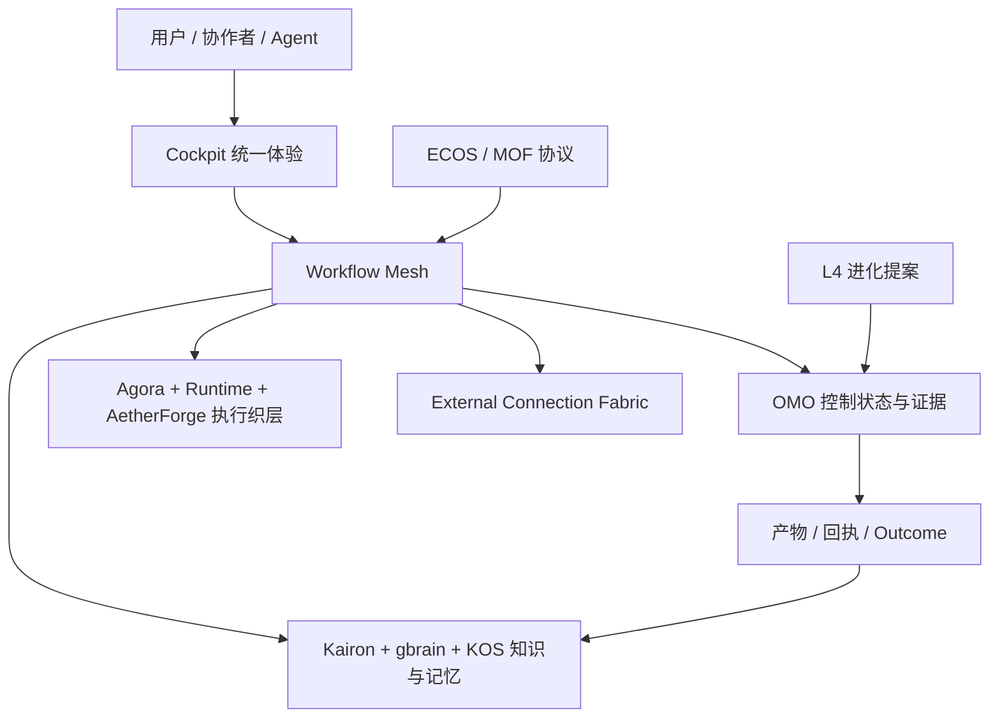

# eCOS v6 愿景与 Roadmap

> 个人工作与决策执行操作系统：从信号和意图到可靠结果、证据、记忆与受控进化。

---

## 稳定愿景

eCOS 的终极愿景不是拥有最多的 Agent、设备、模型和治理规则，而是让系统所有者在真实工作中
获得一种持续可靠的能力：只表达一次意图，系统就能理解上下文、形成计划、调动合适的人与
工具、完成执行、留下证据、记住经验，并在边界内逐步改善。

```text
信号或意图
  -> 理解、关联与判断
  -> 可审批的计划
  -> 人 / Agent / 工具 / 外部系统协同执行
  -> 产物、回执和验证
  -> 被消费的业务结果
  -> 记忆、评测和改进提案
```

愿景的产品形态是“个人工作与决策执行 OS”，首要服务系统所有者的信息化工作管理与工程建设，
再通过领域包扩展到其他真实场景。聊天、搜索、Dashboard、知识图谱、OCR、模型路由和多 Agent
都是完成旅程的能力，不是产品终点。

## 愿景原则

1. 结果有归处：每次旅程都能找到状态、产物、回执、证据和下一步。
2. 一次表达：用户不在多个项目 CLI、任务库和页面重复录入同一意图。
3. 没有死路：失败、不可用和低置信度均可解释、接管、恢复或回滚。
4. 渐进披露：默认先回答“现在做什么”，复杂架构和治理证据按需展开。
5. 状态真实：UI 不用 mock、随机或文件存在冒充真实运行和完成。
6. 本地优先：私有原文、身份和凭据默认留在受控边界内。
7. 场景扩展：新业务通过 DomainPack，外部能力通过 External Connection Fabric 接入。
8. 受控进化：系统只提出并评测改进，生产晋升必须可审批、可灰度、可撤销。

## 北极星

北极星指标是“每周成功完成且被实际消费的闭环旅程数”。它必须按场景拆分，并同时满足：

- 有真实用户意图或业务信号。
- 通过统一入口和 Workflow Mesh 运行。
- 产生可使用的产物或行动。
- 有回执、验证或人工确认。
- 有来源、证据和失败恢复路径。
- 结果被打开、采用、提交、派发或引用。

## 愿景场景

| 波次 | 场景 | 愿景结果 |
|---|---|---|
| 第一波 | 公文起草与审查、会议到督办、工程交付 | 三条高价值闭环成为日常默认入口 |
| 第二波 | 周期报送、绩效证据包、项目监督、合同风险 | 同一 Mesh 和领域包合同跨场景复用 |
| 第三波 | 政策研究到行动、受控多 Agent、预测性风险 | 智能策略由真实评测证明价值 |
| 第四波 | 多设备、团队空间、可审核领域/连接生态 | 核心方法在第二个真实环境复制 |

Family Hub、KEMS 独立产品化和物理多机当前不构成主轴。它们只有通过场景激活门、出现真实
容量或协作需求后才恢复投入。

## 愿景架构



稳定边界：Cockpit 是人类入口，Agora 是能力和 Agent 入口，OMO 是任务/运行/审批/证据真相，
Runtime 是实际执行，AetherForge 是模型与算力，知识层保存可复用上下文，ECOS 定义协议，L4
只生成提案。任何子项目不得复制这组权威职责。

## 愿景路线

| 时间窗 | 核心问题 | 退出条件 |
|---|---|---|
| 0-30 天 | 产品真相和 Tier 0 场景能否收敛 | 样板有真实输入、入口、责任人、结果和统一身份 |
| 31-90 天 | 三条样板能否端到端可用 | 连续真实运行，失败可恢复，结果从 Cockpit 可消费 |
| 3-6 个月 | 核心闭环能否跨场景复用 | 多类业务复用相同 Mesh/DomainPack 并证明收益 |
| 6-12 个月 | 智能能否被真实评测约束 | 至少一个策略稳定超过基线且可回滚 |
| 12-24 个月 | 能否成为高频个人执行 OS | 多领域共享任务、知识、记忆和复盘闭环 |
| 24-36 个月 | 能否在第二环境复制 | 不分叉内核即可迁移场景、权限和连接 |

详细产品场景、全部子项目边界、Mesh Workflow 蓝图、外部动态扩展与阶段门槛由
[`STRATEGY-3YEAR-PANORAMA.md`](STRATEGY-3YEAR-PANORAMA.md) 统一拥有；实施状态由
[`WORKFLOW-MESH-IMPLEMENTATION.md`](WORKFLOW-MESH-IMPLEMENTATION.md) 与运行 SSOT 拥有。

<details>
<summary>历史版本：以多机、角色和蜂群能力为主线的路线图（已被场景优先路线取代）</summary>

下述内容保留为历史愿景证据，不再用于确定当前优先级、阶段和资源投入。

## 一、愿景定义

### 1.1 终极愿景

```
┌─────────────────────────────────────────────────────────────────────────────────┐
│                                                                                 │
│              🧠 蜂群式AI超级大脑 — 个人OPC外置数字大脑                           │
│                                                                                 │
│  ┌─────────────────────────────────────────────────────────────────────────┐   │
│  │                                                                         │   │
│  │   多机协作     多角色Agent     多场景支持     多领域融合                 │   │
│  │   ┌─────┐     ┌─────┐        ┌─────┐        ┌─────┐                   │   │
│  │   │ 🖥️🖥️│     │ 👨‍💻👨‍🔬│        │ 📚💼│        │ 🔬🎨│                   │   │
│  │   │ 📱💻│     │ 👨‍🎨👨‍🏫│        │ 🏠🚗│        │ 💰🏥│                   │   │
│  │   └─────┘     └─────┘        └─────┘        └─────┘                   │   │
│  │       │           │              │              │                       │   │
│  │       └───────────┴──────────────┴──────────────┘                       │   │
│  │                           │                                              │   │
│  │                           ▼                                              │   │
│  │              ┌─────────────────────────┐                                │   │
│  │              │   🧠 个人数字大脑        │                                │   │
│  │              │   知识 · 记忆 · 推理     │                                │   │
│  │              │   学习 · 创造 · 协作     │                                │   │
│  │              └─────────────────────────┘                                │   │
│  │                                                                         │   │
│  └─────────────────────────────────────────────────────────────────────────┘   │
│                                                                                 │
└─────────────────────────────────────────────────────────────────────────────────┘
```

### 1.2 核心价值主张

| 价值 | 说明 |
|------|------|
| **无限扩展** | 多机协作，突破单机限制 |
| **智能分工** | 多角色Agent，专业协作 |
| **场景适配** | 多场景支持，无缝切换 |
| **知识融合** | 多领域融合，跨域创新 |
| **个人专属** | 个人数字大脑，量身定制 |

---

## 二、能力模型

### 2.1 能力矩阵

```
┌─────────────────────────────────────────────────────────────────────────────────┐
│                          蜂群式AI超级大脑能力模型                                │
├─────────────────────────────────────────────────────────────────────────────────┤
│                                                                                 │
│  ┌─────────────────────────────────────────────────────────────────────────┐   │
│  │  基础层 (L0-L1)                                                        │   │
│  │  ┌─────────┐ ┌─────────┐ ┌─────────┐ ┌─────────┐ ┌─────────┐         │   │
│  │  │  协议   │ │  运行时  │ │  算力   │ │  网络   │ │  存储   │         │   │
│  │  │ Protocol│ │ Runtime │ │Compute │ │Network │ │Storage │         │   │
│  │  └─────────┘ └─────────┘ └─────────┘ └─────────┘ └─────────┘         │   │
│  └─────────────────────────────────────────────────────────────────────────┘   │
│                                    │                                            │
│  ┌─────────────────────────────────────────────────────────────────────────┐   │
│  │  引擎层 (L2)                                                           │   │
│  │  ┌─────────┐ ┌─────────┐ ┌─────────┐ ┌─────────┐ ┌─────────┐         │   │
│  │  │  知识   │ │  推理   │ │  记忆   │ │  学习   │ │  创造   │         │   │
│  │  │Knowledge│ │Reasoning│ │Memory  │ │Learning│ │Creative│         │   │
│  │  └─────────┘ └─────────┘ └─────────┘ └─────────┘ └─────────┘         │   │
│  └─────────────────────────────────────────────────────────────────────────┘   │
│                                    │                                            │
│  ┌─────────────────────────────────────────────────────────────────────────┐   │
│  │  智能层 (L3-L4)                                                        │   │
│  │  ┌─────────┐ ┌─────────┐ ┌─────────┐ ┌─────────┐ ┌─────────┐         │   │
│  │  │  协作   │ │  决策   │ │  创新   │ │  适应   │ │  进化   │         │   │
│  │  │Collabor.│ │Decision│ │Innovat.│ │Adapt   │ │Evolv   │         │   │
│  │  └─────────┘ └─────────┘ └─────────┘ └─────────┘ └─────────┘         │   │
│  └─────────────────────────────────────────────────────────────────────────┘   │
│                                    │                                            │
│  ┌─────────────────────────────────────────────────────────────────────────┐   │
│  │  应用层 (用户界面)                                                      │   │
│  │  ┌─────────┐ ┌─────────┐ ┌─────────┐ ┌─────────┐ ┌─────────┐         │   │
│  │  │  交互   │ │  展示   │ │  反馈   │ │  定制   │ │  集成   │         │   │
│  │  │Interact │ │Present │ │Feedback│ │Custom  │ │Integrat│         │   │
│  │  └─────────┘ └─────────┘ └─────────┘ └─────────┘ └─────────┘         │   │
│  └─────────────────────────────────────────────────────────────────────────┘   │
│                                                                                 │
└─────────────────────────────────────────────────────────────────────────────────┘
```

---

## 三、Roadmap 规划

### 3.0 当前执行位置

路线图的目标仍是“收敛执行面 → 兑现蜂群 → 跃迁个人大脑”。当前应以运行态与验收文档为准：

- 当前阶段、波次、健康状态与下一里程碑：[`.omo/state/system.yaml`](../.omo/state/system.yaml)。
- 多智能体协作优先、物理多机延后：[`ADR-0247`](../.omo/_knowledge/decisions/0247-strategic-pivot-collab-first-physical-deferred.md)。
- Phase 46 的 Registry、同步与故障转移验收：[`projects/runtime/src/runtime/registry/README.md`](../projects/runtime/src/runtime/registry/README.md)。
- 用户价值主流程与验收口径：[`PROJECT-COMPLETE-GUIDE.md`](PROJECT-COMPLETE-GUIDE.md) 和 [`G-DEL-PHASE2-BOARD.md`](G-DEL-PHASE2-BOARD.md)。

因此，项目目前处在**基础设施收敛末段、兑现期入口**：核心能力正在从“代码存在”推进到“可同步、可故障转移、可证明”；尚未进入真实物理多机和个人大脑产品化阶段。进入下一阶段的必要条件不是继续堆功能，而是完成 Registry 端到端验收、真实用户流程走查，并让多角色协作产生可重复的业务收益。

### 3.1 总体路线图

```
2026 Q3          2026 Q4          2027 Q1          2027 Q2          2027 Q3
    │                │                │                │                │
    ▼                ▼                ▼                ▼                ▼
┌─────────┐    ┌─────────┐    ┌─────────┐    ┌─────────┐    ┌─────────┐
│ Phase 1 │ → │ Phase 2 │ → │ Phase 3 │ → │ Phase 4 │ → │ Phase 5 │
│ 基础设施 │    │ 多机协作 │    │ 多角色  │    │ 蜂群智能 │    │ 个人大脑 │
│ 完善    │    │ 实现    │    │ Agent   │    │ 实现    │    │ 完善    │
└─────────┘    └─────────┘    └─────────┘    └─────────┘    └─────────┘
```

### 3.2 Phase 1: 基础设施完善 (2026 Q3)

**目标**: 完善现有基础设施，为后续扩展奠定基础

| 任务 | 优先级 | 涉及项目 | 预计时间 |
|------|--------|----------|----------|
| 分布式状态同步 | P0 | runtime, omo | 4 周 |
| 跨机通信协议 | P0 | ecos, runtime | 3 周 |
| 统一配置管理 | P1 | cockpit, omo | 2 周 |
| 监控告警完善 | P1 | omo, runtime | 2 周 |
| 文档体系完善 | P2 | 全部项目 | 2 周 |

**交付物**:
- 分布式状态同步机制
- 跨机通信协议规范
- 统一配置管理方案
- 监控告警系统

### 3.3 Phase 2: 多机协作实现 (2026 Q4)

**目标**: 实现跨机器的Agent协作能力

| 任务 | 优先级 | 涉及项目 | 预计时间 |
|------|--------|----------|----------|
| Agent 注册中心 | P0 | runtime, agora | 4 周 |
| 分布式任务调度 | P0 | aetherforge/packages/swarm, runtime | 4 周 |
| 状态同步机制 | P0 | omo, runtime | 3 周 |
| 故障转移机制 | P1 | runtime, aetherforge | 3 周 |
| 负载均衡 | P1 | aetherforge, runtime | 2 周 |

**交付物**:
- Agent 注册中心
- 分布式任务调度器
- 状态同步服务
- 故障转移和负载均衡

### 3.4 Phase 3: 多角色Agent (2027 Q1)

**目标**: 实现标准化的多角色Agent协作

| 任务 | 优先级 | 涉及项目 | 预计时间 |
|------|--------|----------|----------|
| 角色定义框架 | P0 | aetherforge/packages/swarm | 3 周 |
| 角色协作协议 | P0 | aetherforge/packages/swarm, runtime | 3 周 |
| 角色动态切换 | P1 | aetherforge/packages/swarm, metaos | 3 周 |
| 角色记忆共享 | P1 | gbrain, aetherforge/packages/swarm | 3 周 |
| 角色评估系统 | P2 | omo, aetherforge/packages/swarm | 2 周 |

**交付物**:
- 角色定义框架
- 角色协作协议
- 角色动态切换机制
- 角色记忆共享服务

### 3.5 Phase 4: 蜂群智能实现 (2027 Q2)

**目标**: 实现蜂群涌现和集体智能

| 任务 | 优先级 | 涉及项目 | 预计时间 |
|------|--------|----------|----------|
| 涌现行为检测 | P1 | aetherforge/packages/swarm (swarm_engine/ext) | 3 周 |
| 集体决策机制 | P1 | aetherforge/packages/swarm, metaos | 3 周 |
| 自组织能力 | P2 | aetherforge/packages/swarm | 3 周 |
| 进化适应机制 | P2 | aetherforge/packages/swarm (swarm_engine/ext) | 3 周 |
| 蜂群可视化 | P2 | cockpit | 2 周 |

**交付物**:
- 涌现行为检测器
- 集体决策引擎
- 自组织框架
- 进化适应机制

### 3.6 Phase 5: 个人数字大脑 (2027 Q3)

**目标**: 完善个人专属数字大脑

| 任务 | 优先级 | 涉及项目 | 预计时间 |
|------|--------|----------|----------|
| 个人知识图谱 | P1 | gbrain, kos | 4 周 |
| 个人偏好学习 | P1 | gbrain, metaos | 3 周 |
| 个人记忆管理 | P1 | gbrain, omo | 3 周 |
| 个人AI助手 | P2 | cockpit, gbrain | 3 周 |
| 个人数字孪生 | P2 | gbrain, aetherforge/packages/swarm | 4 周 |

**交付物**:
- 个人知识图谱服务
- 个人偏好学习引擎
- 个人记忆管理系统
- 个人AI助手

---

## 四、技术架构演进

### 4.1 当前架构 vs 目标架构

```
当前架构:
┌─────────────────────────────────────────────────────────────┐
│  L4 → L3 → I0 → L2 → L1 → L0                              │
│  单机为主，本地协作                                          │
└─────────────────────────────────────────────────────────────┘

目标架构:
┌─────────────────────────────────────────────────────────────┐
│  ┌─────────────────────────────────────────────────────┐   │
│  │  分布式层 (新)                                       │   │
│  │  ┌─────────┐ ┌─────────┐ ┌─────────┐ ┌─────────┐  │   │
│  │  │  多机   │ │  多角色  │ │  蜂群   │ │  进化   │  │   │
│  │  │Multi-Node│ │Multi-Role│ │Swarm  │ │Evolve  │  │   │
│  │  └─────────┘ └─────────┘ └─────────┘ └─────────┘  │   │
│  └─────────────────────────────────────────────────────┘   │
│                           │                                │
│  ┌─────────────────────────────────────────────────────┐   │
│  │  现有层                                             │   │
│  │  L4 → L3 → I0 → L2 → L1 → L0                      │   │
│  └─────────────────────────────────────────────────────┘   │
└─────────────────────────────────────────────────────────────┘
```

### 4.2 新增组件

| 组件 | 说明 | 涉及项目 |
|------|------|----------|
| Agent Registry | Agent 注册中心 | runtime, agora |
| Distributed Scheduler | 分布式任务调度 | aetherforge/packages/swarm, runtime |
| State Sync Service | 状态同步服务 | omo, runtime |
| Role Framework | 角色定义框架 | aetherforge/packages/swarm |
| Swarm Intelligence | 蜂群智能引擎 | aetherforge/packages/swarm (swarm_engine/ext) |
| Personal Brain | 个人数字大脑 | gbrain, kos |

---

## 五、关键里程碑

### 5.1 里程碑时间线

| 里程碑 | 时间 | 交付物 | 验收标准 |
|--------|------|--------|----------|
| M1: 分布式基础 | 2026-09 | 状态同步 + 通信协议 | 2 机协作验证 |
| M2: 多机协作 | 2026-12 | 注册中心 + 调度器 | 4 机协作验证 |
| M3: 多角色Agent | 2027-03 | 角色框架 + 协作协议 | 3 角色协作验证 |
| M4: 蜂群智能 | 2027-06 | 涌现检测 + 集体决策 | 蜂群行为验证 |
| M5: 个人大脑 | 2027-09 | 知识图谱 + AI助手 | 个人场景验证 |

### 5.2 验收标准

| 阶段 | 验收标准 |
|------|----------|
| Phase 1 | 2 机状态同步延迟 < 100ms |
| Phase 2 | 4 机任务调度成功率 > 99% |
| Phase 3 | 3 角色协作任务完成率 > 95% |
| Phase 4 | 蜂群涌现行为检测准确率 > 80% |
| Phase 5 | 个人知识图谱覆盖率 > 90% |

---

## 六、资源需求

### 6.1 人力资源

| 角色 | Phase 1 | Phase 2 | Phase 3 | Phase 4 | Phase 5 |
|------|---------|---------|---------|---------|---------|
| 架构师 | 1 | 1 | 1 | 1 | 1 |
| 后端开发 | 2 | 3 | 2 | 2 | 2 |
| 前端开发 | 1 | 1 | 1 | 1 | 1 |
| 测试 | 1 | 1 | 1 | 1 | 1 |
| **总计** | **5** | **6** | **5** | **5** | **5** |

### 6.2 基础设施

| 资源 | Phase 1 | Phase 2 | Phase 3 | Phase 4 | Phase 5 |
|------|---------|---------|---------|---------|---------|
| 服务器 | 2 | 4 | 4 | 6 | 4 |
| GPU | 0 | 2 | 2 | 4 | 2 |
| 存储 | 1TB | 2TB | 2TB | 4TB | 2TB |

---

## 七、风险与缓解

### 7.1 技术风险

| 风险 | 概率 | 影响 | 缓解措施 |
|------|------|------|----------|
| 分布式一致性 | 高 | 高 | 采用 CRDT + 最终一致性 |
| 状态同步性能 | 中 | 高 | 增量同步 + 压缩 |
| 蜂群涌现不可控 | 中 | 中 | 限制涌现范围 + 人工干预 |

### 7.2 资源风险

| 风险 | 概率 | 影响 | 缓解措施 |
|------|------|------|----------|
| 人力资源不足 | 中 | 高 | 外包 + 培训 |
| 基础设施成本 | 中 | 中 | 云服务 + 按需扩展 |

---

## 八、成功指标

### 8.1 技术指标

| 指标 | 当前 | Phase 1 | Phase 2 | Phase 3 | Phase 4 | Phase 5 |
|------|------|---------|---------|---------|---------|---------|
| 多机协作 | 30% | 50% | 80% | 85% | 90% | 90% |
| 多角色Agent | 40% | 45% | 50% | 80% | 85% | 85% |
| 蜂群智能 | 50% | 55% | 60% | 65% | 80% | 85% |
| 个人大脑 | 75% | 78% | 82% | 85% | 88% | 90% |

### 8.2 产品指标

| 指标 | 当前 | Phase 5 目标 |
|------|------|--------------|
| 用户满意度 | 70% | 90% |
| 任务完成率 | 80% | 95% |
| 响应时间 | 5s | 1s |
| 系统可用性 | 99% | 99.9% |

---

## 九、总结

### 9.1 愿景

**打造蜂群式AI超级大脑，实现个人OPC外置数字大脑**

### 9.2 路径

```
Phase 1 (Q3'26) → Phase 2 (Q4'26) → Phase 3 (Q1'27) → Phase 4 (Q2'27) → Phase 5 (Q3'27)
基础设施完善      多机协作实现       多角色Agent       蜂群智能实现       个人大脑完善
```

### 9.3 关键成功因素

1. **技术深度** — 分布式系统、蜂群智能、个人知识图谱
2. **架构一致性** — 保持 5+4+1+1 架构的一致性
3. **用户体验** — 无缝的多机、多角色、多场景体验
4. **持续迭代** — 快速迭代，持续改进

---

*版本: 1.0.0 · 创建: 2026-06-12*

</details>
