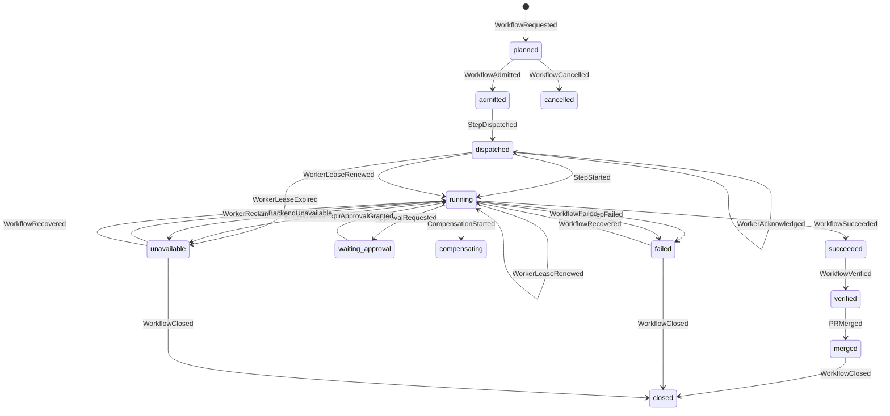

# Workflow Mesh 实施架构与交付路线

## 1. 目标

Workflow Mesh 不是新增一个工作流引擎，而是把现有 C2G、OMO、ECOS、Agora、Runtime、AetherForge、Cockpit 的执行边界收敛到一条可追踪、可恢复、可验收的运行链上。

核心结果是：每一项业务意图都能沿着 `scene_id -> journey_id -> intent_id -> task_id -> workflow_run_id -> step_run_id -> evidence_id -> pr_id` 找到真实执行、失败原因、验证结果和交付结果。

## 2. 模块边界

| 模块 | 责任 | 不负责 |
| --- | --- | --- |
| C2G | 把愿景、策略和业务意图转成受治理任务 | 不直接执行代码或调度 Agent |
| OMO | 任务生命周期、审批、事件原文、运行态投影和审计证据 | 不实现业务步骤 |
| ECOS | M1 工作流定义、契约校验、后端解析和执行编排 | 不持有跨模块事实库 |
| Agora | 能力发现、路由和入口适配 | 不把不可用后端伪装成成功 |
| Runtime | 单步执行、心跳、重试、检查点和恢复 | 不改变工作流定义 |
| AetherForge | Agent、模型和并行计算资源编排 | 不成为业务状态 SSOT |
| Cockpit | 任务操作、运行态、验证和交付可视化 | 不凭 Git 文件存在推断运行成功 |
| gbrain / KOS | 事实记忆和索引检索 | 不承载一次运行的生命周期 |
| MetaOS | 策略、预算、权限和准入约束 | 不绕过执行证据直接宣布完成 |
| External Connection Fabric | 外部资源描述、健康、来源和生命周期 | 不拥有任务、知识、凭据或运行状态真相 |

## 3. 运行身份与事件契约

所有执行必须拥有稳定的 `workflow_run_id`，默认让 `trace_id` 与其一致；调用方重试时可复用同一 ID，禁止为同一次业务执行创建无法关联的新运行。面向产品的执行还必须绑定 `scene_id`、`journey_id` 和 `outcome_metric`，否则只能进入 proposal-only 或 sandbox。

事件采用 `workflow-mesh/v1` 信封，至少包含：

`event_id`、`event_type`、`trace_id`、`workflow_run_id`、`occurred_at`、`producer`、`schema_version`、`idempotency_key`、`payload`。

OMO 只追加原始事件，再由投影器生成运行快照。重复 `event_id` 或重复 `idempotency_key` 且内容相同是幂等成功；内容冲突必须失败。只有 `closed` 是不可再推进的终态；`succeeded`、`failed`、`unavailable` 必须分别进入验证、关闭或显式恢复，不得被提前当成结案。

## 4. 状态机



`succeeded` 表示执行步骤成功，`verified` 表示验证证据已通过，`merged` 表示交付已进入主线，`closed` 表示生命周期已结案；这几个状态不能混用。失败和不可用只能通过 `WorkflowRecovered` 回到运行态。

## 5. 本轮已落地

- ECOS 增加统一运行元数据和事件信封生成器。
- 明确指定但未注册、无法导入的后端现在 fail-closed，不再偷偷执行 default。
- Agora、Runtime、Swarm 在服务不可用时返回 `BACKEND_UNAVAILABLE`，不再返回 fake mock success。
- ECOS 检测嵌套的 mock/simulation 结果并阻断“假成功”。
- ECOS 支持注入 OMO-compatible event sink，执行开始和结束可以写入同一条 trace。
- ECOS 执行 admitted、step dispatch/start、step failure 和 terminal 事件，并为事件生成稳定幂等键。
- OMO 增加 Workflow Mesh 事件信封、按 event/idempotency key 幂等的 AppendOnlyLog 存储和严格运行态投影。
- OMO 快照保留 workflow、task、intent、evidence、PR 元数据，支持从事件恢复业务链路。
- Cockpit 将“有 Git worktree”与“有活动 Agent Workflow run”分开；无活动 run 时显示 `stale`。
- Cockpit 在 Agent Workflow YAML 缺失时直接消费 OMO Mesh 快照，展示真实运行、验证、PR 和证据阶段。
- Runtime `AgentRuntime.run_task` 支持注入 `event_sink`，发出 requested/admitted、step dispatch/start、heartbeat、checkpoint、failure 和 terminal 事件；payload 不包含提示词和模型输出。
- AetherForge `GraphWorkflow.run` 支持相同的 `workflow_run_id / trace_id / event_sink` 入口，并在 Swarm RPC 中透传，节点执行可直接投影到 OMO。
- 根仓跨模块验收已用真实 Runtime 与 Swarm 执行写入 OMO append-only store，并验证两个运行快照均收敛到 `succeeded`。
- Runtime 提供 append-only `WorkflowCheckpointStore`，保存安全执行边界并支持同一 run 恢复；完成态恢复直接返回已持久化结果，避免重复调用模型。
- AetherForge Swarm 图执行器支持从最后一个已提交节点 checkpoint 继续，失败节点会重放，已经成功的节点不会重复执行。
- OMO 快照现在包含 `step_runs`、`checkpoints`、`evidence`、`approvals`，提供 StepRun/Evidence 查询入口，并拒绝没有 Evidence 的 `WorkflowVerified`。
- ECOS 将 `workflow_run_id / trace_id` 透传到后端；Runtime 子进程通过环境变量接收，AetherForge CLI 通过显式参数接收。
- ECOS 生成带 `admission_id / step_run_ids / policy_digest / expires_at / proof` 的短期执行授予；OMO 校验授予后才接受 StepRun 事件，Runtime 与 AetherForge 在 Mesh 运行中缺少或伪造授予时 fail-closed。
- Runtime/AetherForge 的子进程传播会为具体执行器派生子授予，保留父授予关联并避免把未获准的内部步骤伪装成已授权。
- OMO 增加 admission/dispatch broker：审批、能力健康、预算门禁通过后才追加 `WorkflowRequested` 与 `WorkflowAdmitted`，并把同一授予注入 worker envelope/dispatch record。
- OMO 将 worker 派发桥接到 Mesh：`StepDispatched` 绑定 `dispatch_id`、`worker_id`、`step_run_id` 和 `admission_id`；worker ACK、租约续期、租约失效和接管分别落为 `WorkerAcknowledged`、`WorkerLeaseRenewed`、`WorkerLeaseExpired`、`WorkerReclaimed`，并在同一 append-only 日志中幂等投影。
- Agora 增加只读 capability health projection，将 agent、Swarm node、服务和 backend 的心跳/可用性投影成统一快照；它只提供证据，不替 OMO 迁移状态或越权放行。
- Agora 增加 `ExternalConnectionCatalog`：通过 `external.resources` entry point 动态发现 descriptor，执行场景/权限/健康/期限/回滚准入，按决策因子路由，并在无候选时返回显式 unavailable。
- Iris 将 connector 同时暴露为 `iris.connectors` 和 `external.resources`，新增连接器不需要修改 Agora 路由代码。
- `ConnectionReceipt` 只携带 receipt、来源、策略、摘要哈希和结果状态，可直接生成 OMO `EvidenceRecorded` payload；`proposal_only` 资源不执行副作用。
- Runtime 增加显式 retry policy、稳定 effect key 的副作用日志和 replay，AetherForge 增加节点重试与可选 compensation hook；默认不重试，避免隐式放大副作用。
- OMO 增加 `workflow_eval`：从真实 append-only 事件生成 `workflow-mesh-eval/v1` 数据集，保留事件 ID 作为标签来源，并提供只读的候选策略离线评估/人工审批 proposal。
- 各模块增加 fail-closed、事件投影、幂等和 stale 状态测试。

## 6. 分阶段路线

### P0：执行真相收敛

1. 将所有跨层调用统一映射到 `workflow_run_id / trace_id`（ECOS、OMO、Cockpit、Runtime、AetherForge 已具备注入式入口；CLI/subprocess 传播仍需在真实部署链路中逐步打开）。
2. 给 Runtime 和 Agent 执行补齐 `StepDispatched`、`StepStarted`、`StepHeartbeat`、`StepFailed`、`CheckpointSaved`（ECOS、Runtime、AetherForge 已完成事件发射；当前 checkpoint 是控制面进度证据，尚不是可恢复的业务状态快照）。
3. 将审批、预算、权限和后端可用性纳入 admitted gate；ECOS 现在签发短期 admission grant，OMO、Runtime、AetherForge 三侧共同校验；没有证据就不能进入 verified。
4. Cockpit 优先读取 OMO 投影和事件证据；在没有 Mesh 事件的历史兼容场景保留 `stale` 降级，不把 Git 文件存在推断为成功。

### P1：可恢复执行

1. OMO 将事件投影扩展为 WorkflowRun、StepRun、Approval、Evidence 的权威读接口；写入仍统一走事件 sink。
2. Runtime 和 AetherForge 已以持久化 checkpoint 实现断点恢复与完成态幂等，并要求 Mesh 运行携带有效 admission grant；首版显式 retry/effect journal/compensation 已落地，网络传输级 timeout、真实外部系统 receipt 和跨进程 effect store 仍需继续落地。
3. Agora 已增加能力健康 projection 和 MCP 查询入口；版本、权限声明与降级原因的生产级采集仍需绑定真实节点注册和服务心跳。
4. ECOS 已将运行身份和子授予传递到 Runtime/AetherForge；AetherForge 只接收已 admitted 的 StepRun，资源失败回写 `unavailable/failed` 的细化策略仍是下一交付项。

### P2：智能化与进化

1. 用历史运行事件和验证结果生成真实标注评测集，按业务旅程评估成功率、误报率和恢复率。
2. 让模型只提出候选分解、路由和重试策略，准入与状态迁移仍由契约和策略控制。
3. 建立基于证据的 workflow 版本比较、成本分析和自动淘汰机制。
4. 将高频稳定流程提升为模板，将不稳定流程沉淀为治理债务和人工审批规则。
5. `workflow_eval` 先完成事件衍生标签和 proposal-only 反馈；待真实运行样本达到业务阈值后，再引入预测模型，模型不得直接写入 admission 或状态机。

### P2.5：外部连接与触达

1. 所有外部知识、数据、资源、方法、工具、模型和渠道先登记为统一 descriptor，再由 OMO 按场景准入。
2. SourcePack 默认 live query 或有期限快照；未经审批不得全量复制私人原文。
3. MethodPack 由 Sophia 编译为候选工作流，必须经过离线评测、proposal-only、shadow 和人工批准。
4. ToolPack、ModelPack 和 ChannelPack 由 Agora、AetherForge、Runtime 分别路由和执行，回执必须回到同一条 Mesh 事件链；Agora 的 `ConnectionReceipt.evidence_payload()` 直接生成 `EvidenceRecorded` 所需的最小字段。
5. 外部不可用、权限过期、数据过时或预算超限时，工作流进入 `degraded/unavailable`，禁止假成功。
6. 外部 provider 通过 `external.resources` 动态加入；descriptor 变更先记录差异并重新评估准入，单个 provider 探活失败只隔离该候选。
7. SourcePack、MethodPack、ModelPack 和 ChannelPack 必须携带刷新/评测/回滚证据；没有真实场景、结果指标和责任人时保持 `sandbox` 或 `proposal_only`。

### P1.5：派发与健康闭环

1. 通过 OMO admission/dispatch broker 生成唯一的 `workflow_run_id`、短期 grant 和 worker dispatch packet；任何 capability、approval 或 budget gate 失败都不得产生执行派发。
2. Agora 以 `workflow_capability_health` 输出统一的 `healthy/degraded/unhealthy` 快照，附带每项 capability 的来源节点、服务或 backend，作为 admission 的输入证据。
3. 外部连接 receipt 已能回写同一条 Mesh 事件链；worker ACK、租约心跳、超时失效和接管的事件合同已经落地。下一步是把真实 daemon/watchdog 与这组 API 接上，并把外部系统的真实副作用回执接入同一条链，不能只把 packet 生成当成执行完成。

4. 外部连接调用必须使用 `resource_id + trace_id + receipt_id` 作为可重放边界；原文不进入 Mesh
   事件，只有 provenance、摘要、哈希和结果状态进入证据面。

### 6.1 Worker 控制面合同

`dispatch.yaml`、envelope、prompt 和 checkpoint 是操作与交接材料，不是 WorkflowRun 的事实来源。
真实 worker 生命周期必须以同一组上下文写入 OMO：

| 事件 | 前置条件 | 结果 |
| --- | --- | --- |
| `StepDispatched` | admitted grant、已生成 dispatch artifact | 绑定 worker 和 StepRun |
| `WorkerAcknowledged` | worker 身份与 dispatch 匹配 | 建立首个租约，保持 `dispatched` |
| `WorkerLeaseRenewed` | 当前租约仍有效且 ACK 已存在 | 更新 heartbeat 和到期时间，进入 `running` |
| `WorkerLeaseExpired` | 观测时间不早于租约到期 | 进入 `unavailable`，保留失效原因 |
| `WorkerReclaimed` | 已存在失效租约 | 绑定 successor worker/dispatch，恢复 `running` |

所有事件都要求 `dispatch_id`、`worker_id`、`step_run_id`、`admission_id`，并使用稳定的
`idempotency_key`。重复且内容一致的调用返回原事件；内容冲突或越权 worker 必须失败。当前
可通过 `omo worker mesh-ack`、`mesh-heartbeat`、`mesh-expire`、`mesh-reclaim` 调用，自动
watchdog 触发仍属于下一阶段的真实部署接入。

## 7. 关键里程碑与验收

| 里程碑 | 交付条件 | 验收口径 |
| --- | --- | --- |
| M0 执行真实 | 后端不可用不再 fake success | 不可用路径全部有明确错误码和测试 |
| M1 证据贯通 | 一条运行能关联事件、步骤和验证 | 任意 run 可由 ID 重建快照 |
| M2 可恢复 | 中断后可从 checkpoint 继续 | 重试不重复产生业务副作用 |
| M3 业务闭环 | 任务从意图走到验证和交付 | 每周统计真实完成旅程，不统计声明数 |
| M4 自进化 | 评测集、成本和策略反馈闭环 | 新策略先过离线评测，再进入受控灰度 |

建议持续观察：真实完成旅程数、端到端成功率、无证据完成率、后端不可用率、恢复成功率、人工介入率、单旅程成本和事件投影延迟。

## 8. 明确延期和边界

当前不引入第二套工作流引擎、不把 Cockpit 做成状态写入端、不直接把 gbrain/KOS 当运行时数据库，也不在缺少真实业务场景时提前建设大规模 OCR、知识图谱或预测模型生产链。外部连接同样必须先绑定真实业务旅程，再扩大覆盖面。

## 9. 验证命令

```bash
cd projects/ecos && uv run pytest -q tests/test_workflow_mesh_contract.py tests/test_m1_adversarial.py tests/test_adversarial_m1.py tests/test_swarm_no_subprocess.py
cd projects/omo && PYTHONPATH=src uv run --no-project --with pytest --with pyyaml --with pydantic --with httpx python -m pytest -q tests/test_workflow_mesh.py tests/test_worker_lifecycle_mesh.py tests/test_workflow_dispatch.py tests/test_omo_io_pydantic.py
cd projects/cockpit && PYTHONPATH=src uv run --no-project --with pytest --with fastapi --with pyyaml --with httpx --with rich python -m pytest -q src/cockpit/tests/test_delivery_journey.py src/cockpit/tests/test_delivery_journey_mesh_states.py src/cockpit/tests/test_delivery_journey_workflow_mesh.py src/cockpit/tests/test_agent_workflow_command.py
cd projects/runtime && PYTHONPATH=src uv run --no-project --with pytest --with pydantic python -m pytest -q tests/test_workflow_mesh_runtime.py
cd projects/aetherforge && PYTHONPATH="packages/swarm/src:src" uv run --no-project --with pytest python -m pytest -q packages/swarm/tests/test_workflow_mesh.py
PYTHONPATH="projects/omo/src:projects/runtime/src:projects/aetherforge/packages/swarm/src" uv run --no-project --with pytest --with pydantic --with pyyaml --with httpx python -m pytest -q tests/integration/workflow_mesh/test_runtime_and_swarm_projection.py
```
